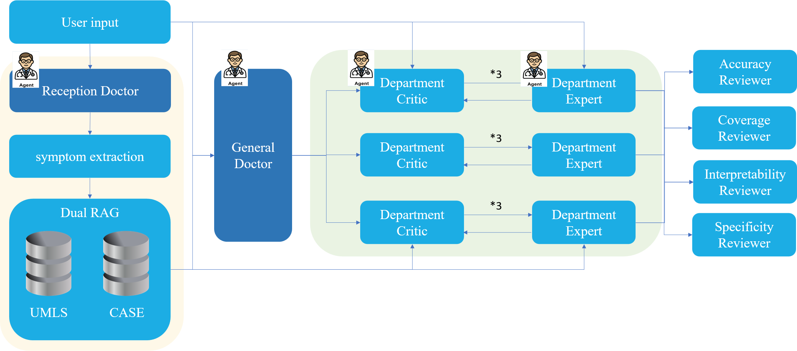
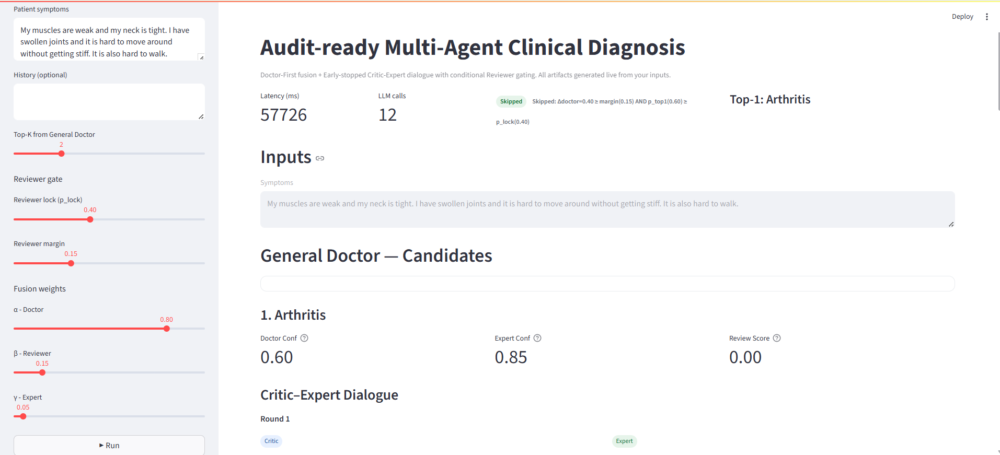
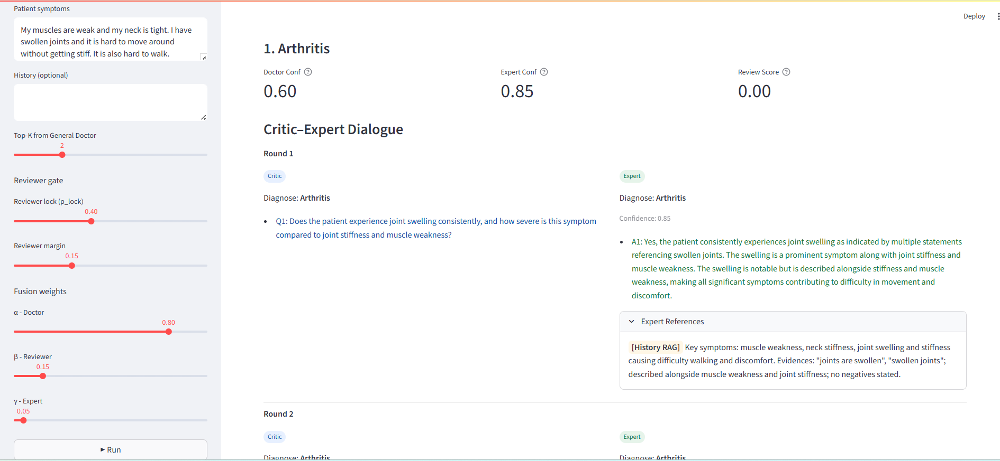

# MultiAgents for Medical Diagnosis  
*An audit-ready, multi-agent framework for clinical diagnosis with dual-RAG retrieval and conditional reviewer gating.*

---

## 🌟 Motivation

Medical diagnosis is a common but difficult problem.  
- Medical diagnosis is inherently uncertain.
- Medical language is nuanced: **symptoms ≠ free-text**. 
- Easy to misdiagnosis due to different descriptions.

While Large Language Models (LLMs) show promise in clinical reasoning, a **single-agent system** is often:  
- Uncontrollable and purposeless in reasoning steps.  
- Difficult to **audit** or **explain**.  
- Hard to ensure reliability in critical healthcare settings  

👉 We propose a **multi-agent framework** that emphasizes **transparency, interpretability, and auditability**.

---

## 🚀 Key Contributions

- **Reception Doctor (Student + Teacher modes)**  
  - Extracts structured symptoms and reasoning chains from raw patient text  
  - Teacher mode: enriches historical case database with *symptoms + reasoning*  
  - Student mode: standardizes patient inputs for downstream modules  

- **Dual-RAG Retrieval**  
  - Combines **UMLS ontology** (medical knowledge base) with **historical curated cases**  
  - Historical cases are iteratively updated from Reception Doctor (teaching mode)  
  - Matching is performed on structured symptoms, reducing noise from free-form language  

- **Multi-Agent Framework**  
  - *General Doctor* provides initial hypotheses  
  - *Department Critic–Expert* engage in multi-round debates  
  - *Reviewers* (accuracy, coverage, interpretability, specificity) score results  

- **Conditional Reviewer Gate**  
  - Dynamically decides whether reviewer evaluation is necessary  
  - Balances efficiency and cost with reliability and auditability  

- **Interactive Web Demo**  
  - Real-time visualization of diagnostic pipeline  
  - Shows intermediate reasoning, reviewer decisions, and final fusion scores  

- **Reproducible Experiments**  
  - Extensive ablations: SingleAgent, CoT, RAG, MultiAgent  
  - Significant improvements in Top-1 accuracy and mean reciprocal rank  

---

## 🏗️ System Overview

  

**Pipeline**:  
1. **Reception Doctor** → symptom extraction  
2. **Dual-RAG Retrieval** → UMLS + historical case base  
3. **General Doctor** → initial diagnosis hypotheses  
4. **Critic–Expert debate** → multi-round validation  
5. **Reviewer Gate** → conditional evaluation  
6. **Final Fusion** → transparent scoring & ranking  

---

## ⚙️ Installation

### Option 1: Docker (Recommended)
```bash
# Build and run
docker compose up --build

# Then open in browser
http://localhost:7860
```

### Option 2: Manual Installation
```bash
# Clone repo
git clone MultiAgents 
cd MultiAgents

# Install dependencies
python3.10 -m venv venv
source venv/bin/activate
pip install -r requirements.txt

# Run demo
streamlit run app/web_demo.py --server.port=7860
```

## 🎮 Demo Showcase

Launch the web app → input **patient symptoms** → tune parameters → get real-time diagnostic reasoning.

**Demo Parameters**
- *Top-K*: number of candidate diagnoses from General Doctor  
- *Reviewer lock (p_lock)*: threshold for triggering reviewer evaluation  
- *Reviewer margin*: sensitivity for reviewer intervention  
- *Fusion weights*: relative importance of doctor, reviewer, and expert  

  
  


## 📊 Experiments & Results

**Symptom → Disease prediction (Top-k Accuracy & MRR):**

| Method                 | Top-1   | Top-2   | Top-3   | Mean MRR |
|-------------------------|---------|---------|---------|----------|
| SingleAgent             | 45.28%  | 14.15%  | 6.13%   | 54.40%   |
| SingleAgent + CoT       | 46.23%  | 9.91%   | 0.66%   | 53.38%   |
| SingleAgent + CoT + RAG | 74.53%  | 6.60%   | 0.47%   | 77.99%   |
| **MultiAgent (ours)**   | **96.46%** | 1.77%   | 1.77%   | **97.97%** |

📌 **Conclusion**: Our method dramatically improves accuracy while enabling transparent, auditable reasoning.

**How to Reproduce Experiments:**  
```bash
# run SingleAgent
python ablation_experiments/singleAgent.py

# run SingleAgentCot
python ablation_experiments/singleAgentCot.py

# run SingleAgentCotRAG
python ablation_experiments/singleAgentCotRAG.py

# run MultiAgent(our method)
python core/agent_executor.py
```
---

## 🔑 Credentials

- Requires valid API keys (e.g., OpenAI)  
- Copy `.env.example` → `.env` and set:

```bash
OPENAI_API_KEY=xxxx
```

## 📚 References

- Dataset: https://huggingface.co/datasets/gretelai/symptom_to_diagnosis
- UMLS Metathesaurus: https://www.nlm.nih.gov/research/umls
- HuggingFace Embedding Model: intfloat/e5-large-v2
- Streamlit Documentation: https://docs.streamlit.io

## 📂 Project Structure
```bash
MultiAgents/
├── app/ # Streamlit web demo (frontend + backend)
│ ├── web_demo.py # Main entry for Streamlit UI
│ ├── web_backend.py # Backend logic (connects agents & resource pool)
│ └── demo_cases.json # Predefined demo patient cases
│
├── agents/ # All agent definitions
│ ├── Reception_agent.py # ReceptionDoctorAgent (symptom extraction, dual mode)
│ ├── GeneralDoct_agent.py # GeneralDoctorAgent (generate candidate diagnoses)
│ ├── DeptCritic_agent.py # CriticAgent (asks clarifying questions)
│ ├── DeptExpert_agent.py # ExpertAgent (domain expert responses)
│ ├── Reviewer_agent.py # ReviewerAgent (conditional gate evaluation)
│ └── Decision_agent.py # DecisionAgent (final fusion and ranking)
│
├── case_core/ # Case management & Dual-RAG retrieval
│ ├── case_rag.py # Historical case retrieval (symptom-based matching)
│ └── umls_rag.py # UMLS retrieval for medical knowledge grounding
│
├── umls_core/ # umls management & Dual-RAG retrieval
│ ├── case_rag.py # Historical case retrieval (symptom-based matching)
│ └── umls_rag.py # UMLS retrieval for medical knowledge grounding
│
├── case_out/ # case-RAG saving file
│
├── umls_out/ # umls-RAG saving file
│
├── core/ # Shared utilities
│ ├── util.py # ResourcePool, index loading, helper functions
│ └── logger.py # Logging utilities (latency, tokens, costs)
│
├── config/ # Configurations
│ └── settings.yaml # Model setting
│
├── outputs/ # Run outputs (for experiments logs)
│ └── cases.json  # MultiAgent experiments logs
│ └── SingleAgent  # (SingleAgent ablation experiments log)
│ └── SingleAgentCot  # (SingleAgentCot ablation experiments log)
│ └── SingleAgentCotRAG  # (SingleAgentCotRAG ablation experiments log)
│
├── ablation_experiments/ # Scripts for experiments & evaluation
│ └── SingleAgent.py # Ablation tests (SingleAgent)
│ └── SingleAgentCot.py # Ablation tests (SingleAgent with Cot)
│ └── SingleAgentCotRAG.py # Ablation tests (SingleAgent with Cot and RAG)
│
├── requirements.txt # Python dependencies
├── requirements-lock.txt # Locked versions for reproducibility
├── Dockerfile # Docker container build file
├── docker-compose.yml # Docker Compose setup for local deployment
├── .env.example # Example environment variables (API keys etc.)
└── README.md # Project documentation
```